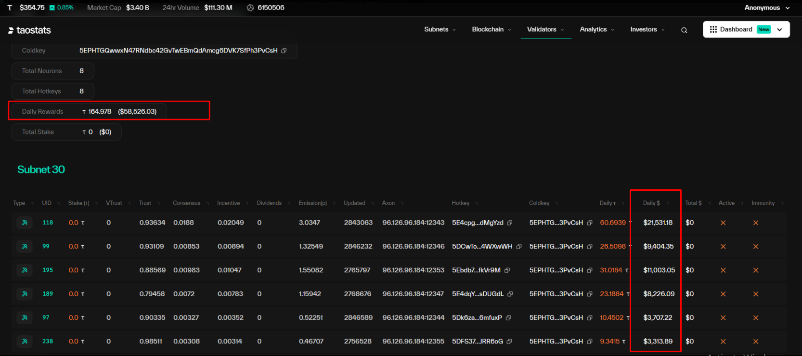

**Describe the Bug**
The USD reward value on the coldkey page (https://taostats.io/coldkey/5EPHTGQwwxN47RNdbc42GvTwEBmQdAmcg6DVK7SfPh3PvCsH) is incorrectly calculated using the TAO price. It should be calculated using the subnet token price instead.

**Steps to Reproduce**
1. Go to https://taostats.io/coldkey/5EPHTGQwwxN47RNdbc42GvTwEBmQdAmcg6DVK7SfPh3PvCsH
2. Look at the USD reward value
3. Verify that it's calculated using TAO price instead of subnet token price

**Expected Behavior**
The USD reward value should be calculated using the subnet token price, not the TAO price.

**Screenshots**

**Environment:**
- Browser: [e.g. Chrome]

**Additional Context**
This affects the accuracy of reward calculations for users who are tracking their earnings in USD. The current implementation may be misleading as subnet token prices can differ significantly from TAO prices.
